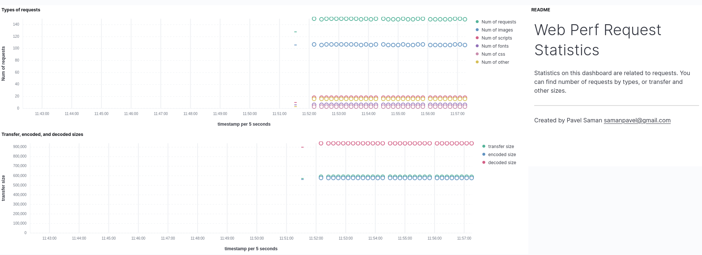

# ps-web-perf-library

This is a tiny library for exporting web performance statistics from Performance API of a browser into Elasticsearch and Kibana.

## Installation

Nothing special here, just use `npm`:

```
$ npm install ps-web-perf-library
```

or `yarn`:

```
$ yarn add ps-web-perf-library
```

Use XYZ Docker image to set up Elastic stack:

```
docker run -it --rm \
--env ELASTICURL=https://web-perf-xxxxxx.es.eu-central-1.aws.cloud.es.io \
--env ELASTICPORT=9243 \
--env ELASTICUSER=elastic \
--env ELASTICPASSWORD=mysecretpwd \
--env KIBANAURL=https://web-perf-xxxxxx.kb.eu-central-1.aws.cloud.es.io \
--env KIBANAPORT=9243 \
--env KIBANAUSER=elastic \
--env KIBANAPASSWORD=mysecretpwd \
ps-elastic-stack-setup
```

## Usage

Typically, you want to use it along with some test framework like WDIO or Puppeteer.

An example could be the following check where you navigate to a homepage:

```javascript
const { exportWebPerfStats } = require('ps-web-perf-library');

it('Open homepage', async () => {
  await browser
    .url(browser.config.baseUrl);

  await expect('#menu')
    .toBeDisplayedInViewport();

  const perfEntries = await browser.execute(() => {
    return window.performance.getEntries();
  });

  await exportWebPerfStats(perfEntries);
});
```

Or a brief example in Puppeteer:

```javascript
const { exportWebPerfStats } = require('ps-web-perf-library');

const perfEntries = await page.evaluate(() => performance.getEntries());
await exportWebPerfStats(perfEntries);
```

Performance statistics from `performance.getEntries()` method will end up in Elasticsearch, and will be displayed on Kibana dashboards.

## Kibana dashboards

There are two dashboards in Kibana:

### Web Perf Request Statistics



### Web Perf Navigation Statistics


