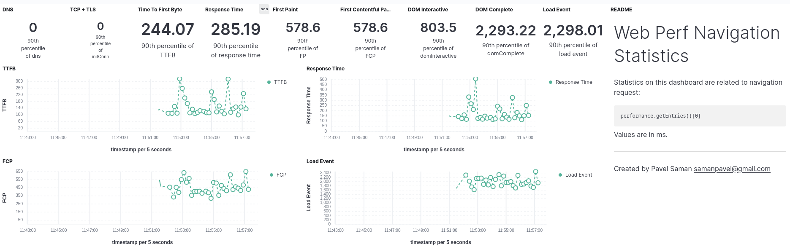

# ps-web-perf-library

This is a tiny library for exporting web performance statistics from Performance API of a browser into Elasticsearch and Kibana.

## Why

A browser can tell you a lot of information about web performance through its [Performance API](https://developer.mozilla.org/en-US/docs/Web/API/Performance_API). But a typical setup is that you lose out on all these pieces of information because you do not gather them. However, with this library, you can collect and send performance entries to Elasticsearch and display them in Kibana.

## Installation

Nothing special here, just use `npm`:

```
$ npm install ps-web-perf-library
```

or `yarn`:

```
$ yarn add ps-web-perf-library
```

Use [`samanpavel/ps-elastic-stack-setup`](https://hub.docker.com/r/samanpavel/ps-elastic-stack-setup) Docker image to set up Elastic stack:

```
$ docker run -it --rm \
--env ELASTICURL=https://web-perf-xxxxxx.es.eu-central-1.aws.cloud.es.io \
--env ELASTICPORT=9243 \
--env ELASTICUSER=elastic \
--env ELASTICPASSWORD=mysecretpwd \
--env KIBANAURL=https://web-perf-xxxxxx.kb.eu-central-1.aws.cloud.es.io \
--env KIBANAPORT=9243 \
--env KIBANAUSER=elastic \
--env KIBANAPASSWORD=mysecretpwd \
samanpavel/ps-elastic-stack-setup
```

## Usage

Typically, you want to use it along with some test framework like WDIO or Puppeteer.

The library needs Elastic credentials, you can prepare a `.env` file where your set them up:

```
ELASTICURL=
ELASTICPORT=
ELASTICUSER=
ELASTICPASSWORD=
```

An example how to use the library in code could be the following check where you navigate to a homepage:

```javascript
require('dotenv').config();
const { exportWebPerfStats } = require('ps-web-perf-library');

it('Open homepage', async () => {
  await browser
    .url(browser.config.baseUrl);

  await expect('#menu')
    .toBeDisplayedInViewport();

  const perfEntries = await browser.execute(() => {
    return window.performance.getEntries();
  });

  await exportWebPerfStats(perfEntries);
});
```

Or a brief example in Puppeteer:

```javascript
require('dotenv').config();
const { exportWebPerfStats } = require('ps-web-perf-library');

const perfEntries = await page.evaluate(() => performance.getEntries());
await exportWebPerfStats(perfEntries);
```

Performance statistics from `performance.getEntries()` method will end up in Elasticsearch, and will be displayed on Kibana dashboards.

If you want to disable sending statistics into Elastic stack, set up environment variable `NOSTATS` to `true`.

I also recommend running a standalone Chrome in a Docker container, e.g.:

```
$ docker run -d -p 4444:4444 --shm-size="2g" \
selenium/standalone-chrome:4.1.0-20211123
```

More on that [here](https://github.com/SeleniumHQ/docker-selenium).

## Kibana dashboards

There are two dashboards in Kibana:

### Web Perf Request Statistics


### Web Perf Navigation Statistics


